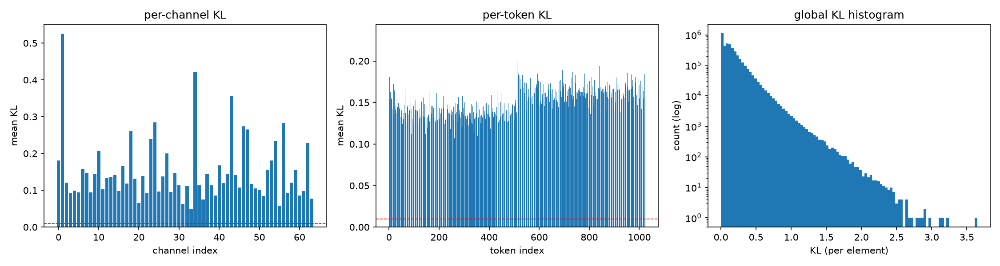

# HunYen3D

A shape autoencoder for 3D generation, implemented in the style of Hunyuan3D-2, together with a
diagnosis of two respects in which its latent representation is left underused and a remedy for
each. The architecture, training loop and preprocessing were written from the papers rather than
forked; the few blocks taken from the Hunyuan3D-2.1 release are marked as such in the source.

---

## At a glance

- **The problem identified.** In this re-implementation of the Hunyuan3D-2 shape autoencoder, **half
  of the latent tokens carry very little information**. The half that falls silent is almost
  entirely the one assigned to creases and sharp edges.
- **The likely cause.** The two groups of query points that define the latent tokens are selected
  independently and therefore frequently coincide, which leaves one member of such a pair redundant.
- **Fix 1 — two-stage sampling.** The sharp-edge query points are selected first, and the uniform
  query points are then selected with the sharp ones already in play, so that the two groups repel
  one another. Token usage rises from 51% to 100% and all four reconstruction metrics improve.
  **No additional parameters.**
- **Fix 2 — λ-VAE.** Tokens account for only part of the problem: the 64 channels within each token
  were also used unevenly. Applying λ-VAE narrows that second disparity and improves every metric
  again.
- **Scale.** 328 million parameters, trained on ShapeNet-v2 on a single RTX 5080 and evaluated on
  all 2,592 shapes of the official test split.

| Metric | Original sampling | Two-stage sampling | Two-stage + λ-VAE |
|---|---|---|---|
| Volume IoU ↑ | 0.8980 | 0.9039 | **0.9171** |
| Chamfer Distance ↓ | 0.0143 | 0.0136 | **0.0127** |
| F-Score @ 0.02 ↑ | 0.9712 | 0.9749 | **0.9834** |
| Normal Consistency ↑ | 0.9477 | 0.9495 | **0.9547** |

*All three models share an architecture, a parameter count, a learning-rate schedule and a KL
weight. They differ in how the query points are selected, in how noise is injected during training
(third column only), and in the number of epochs preceding their best checkpoint: 64, 65 and 67
from left to right. See [Evaluation protocol](#evaluation-protocol) for the definition of these
measurements.*

---

## Background: why the latent space of a 3D generator is worth studying

Generating 3D objects formerly meant generating 2D images and lifting them into three dimensions.
As large 3D datasets became available, the field moved to training directly on 3D data. A common
formulation has two stages: an autoencoder compresses a 3D shape into a compact **latent
representation** (a small set of numbers standing in for the whole object), and a diffusion model
then learns to generate new points within that compressed space.

Two families of latent representation are in use, with different trade-offs.

**Sparse voxel methods** (XCube, TRELLIS) retain an explicit grid in space, so every latent value
carries a known location. Position is represented by the grid rather than having to be recovered
from the latent values themselves. Both must still determine which cells are occupied — TRELLIS
generates the sparse structure in a first stage before filling it — but once that is settled, the
question of where a latent sits is answered outside the latent.

**VecSet methods** (3DShape2VecSet, Dora, Hunyuan3D) dispense with the grid. The shape becomes an
unordered set of latent vectors with no fixed spatial meaning. This compresses more aggressively —
Dora reports matching the dense XCube-VAE with a latent at least eight times smaller, 1,280 codes
against more than 10,000 — but it also requires the generator to produce the surface's *position*
and its *fine detail* simultaneously, from the same set of numbers. That is a more demanding task,
and it is the explanation usually offered for the difficulty VecSet methods have with fine geometric
detail; Ultra3D puts it as the representation's "lack of explicit spatial structure" limiting "its
ability to capture fine-grained geometry".

The Hunyuan3D team's own response was LATTICE: the VecSet output is converted into a voxel-like
representation and a second full generation pass is run on that. It is effective, but it
relinquishes the property that made VecSet distinctive, namely operating without an explicit
spatial grid.

That suggests a different question, and it is the one this project poses:

> **Without reintroducing an explicit spatial grid, can the latent representation itself be better
> structured, so that the generator has less to carry?**

---

## How the latent is laid out

The encoder produces **1,024 latent tokens**, each 64 numbers wide. Each token's query vector in the
encoder's cross-attention is constructed from one point sampled from the object's surface. This
README refers to that point as the token's **query point**, and labels each token by the pool from
which its query point was drawn.

The query points are drawn from two separate pools, constructed for two different purposes:

- **Uniform pool** — points distributed evenly over the whole surface, weighted by triangle area so
  that finely subdivided regions are not over-represented. This provides overall coverage.
- **Sharp pool** — intended to cover creases, which occupy little surface area and are therefore
  sampled rarely by an area-weighted draw. A vertex counts as a crease vertex when its normal
  direction differs from the surrounding faces by more than approximately 10 degrees; an edge counts
  as a crease when *both* of its endpoints qualify; points are then distributed along those edges.

Each pool holds 81,920 points. Every training step draws a fresh subset, and **farthest point
sampling** (a greedy procedure that repeatedly selects the candidate furthest from everything
already chosen, yielding well-spread coverage) reduces each subset to 512 query points. The two
halves are concatenated into the final 1,024 tokens: **tokens 0–511 are the uniform query points and
tokens 512–1023 the sharp query points.**


*Panel (a) is the sampling pipeline described above; panel (b) is the full autoencoder.*

---

## The finding: half the latent tokens carry almost nothing

A variational autoencoder trains under two competing pressures. One rewards reconstruction of the
input; the other, the **KL divergence** term, draws every latent number toward a fixed default
distribution. A token that ceases to be useful for reconstruction has little resisting the second
pressure, so it drifts toward the prior and its output ceases to depend on the input. This is termed
**posterior collapse**, and it is easily missed, because the KL value usually reported is a single
average over the entire latent, in which collapse in one half is concealed by activity in the other.

Decomposing that average per token gives a markedly different picture.


*Original sampling. The middle panel shows one bar per latent token. The uniform half is active; the
sharp half lies flat at the floor.*

The sharp half has fallen silent. Under the standard **Active Units** criterion of Burda et al. — a
dimension counts as used if the variance of its encoded value across shapes exceeds 0.01 — the
tokens whose query points come from the sharp pool fail almost entirely, while the uniform ones all
pass.

Counted at all three levels of granularity — every individual number, every channel, every token:

| Active Units | All 65,536 dimensions | Per-channel (64) | Per-token (1,024) |
|---|---|---|---|
| Original sampling | 34,911 (53.3%) | 61 / 64 | 525 / 1024 |
| Two-stage sampling | 60,617 (92.5%) | 63 / 64 | **1024 / 1024** |

Measured on all 2,592 shapes of the test split.

The model therefore pays for 1,024 tokens and uses approximately half of them, and the unused half
is the one intended to carry sharp detail.

---

## Two explanations that proved incorrect

Two hypotheses were tested and rejected before the explanation given below emerged.

**That the relative geometry should be supplied to the model directly.** Each query point's position
is already present in its features, as a Fourier encoding of its coordinates, so the model could in
principle determine how far apart two points are. **Rotary position embedding** supplies that
relationship within the attention operation itself rather than leaving it to be learned. The
expectation was that, with the distances made explicit, the encoder would read the input shape
better and consequently attend more to the sharp queries. The collapse nevertheless occurred and
reconstruction did not improve. *Implementation:* `RoPEVAE` in `src/model/shape/VAE/vae.py`.

**That the uniform query points are unnecessary.** A person shown only an object's edges can usually
infer its whole shape; if the same holds for the model, the sharp query points alone should suffice,
and the collapse of a redundant uniform branch would be of no consequence. Replacing the uniform
queries entirely with sharp ones tested this directly. Reconstruction became *worse*, so on this
data the uniform query points carry signal that the sharp ones do not replace. *Implementation:*
`FrameVAE` in `src/model/shape/VAE/vae.py`.

---

## The cause: the two query groups coincide in space

Plotting the query points in three dimensions revealed the mechanism. The two pools are sampled
independently, and farthest point sampling spreads points out only *within* its own pool. Nothing
prevents a uniform query point from being placed almost exactly where a sharp query point already
lies.


*Top row: original sampling. Bottom row: two-stage sampling. The left and middle columns show each
branch alone; the right column overlays them, with black rings marking pairs closer than 0.02. On
this chair the original method produces 46 colliding pairs out of 512 and a closest pair of 0.0013;
the two-stage method produces none, with a closest pair of 0.0712. The histogram shows the same for
every query point: the two distributions barely overlap.*

Across the full test set the effect is systematic. The closest pair of query points in a shape
averages **0.0022**. Shapes are normalised into the cube spanning [-1, 1] on each axis, so against
a 2.0-unit coordinate range that places two tokens' cross-attention at almost the same starting
location.

This is the most likely explanation for the collapse. With the two groups overlapping to this
degree, a sharp query point and a uniform one frequently read nearly the same neighbourhood, so one
member of the pair is redundant, and the KL term returns any latent dimension that is not earning
its place toward the prior. Which of the two survives is then determined by which the reconstruction
loss rewards more. That loss is defined over the whole volume, and the uniform queries cover
considerably more of the surface, so relying on them yields the better score; the sharp half is the
less costly one to relinquish. A second mechanism may compound this: every sharp point carries an
explicit flag, which would provide the model with a ready means of identifying the duplicated group.
Both of these are my reading of why the sharp half is the one that goes; the overlap itself is
measured, the choice of which mechanism drives it is not.

---

## Fix 1 — two-stage (seeded) farthest point sampling

The remedy follows directly from the cause, and it is small. Rather than performing the two
selections independently, they are performed **in order**:

1. The sharp query points are selected first, by farthest point sampling on the sharp pool.
2. The uniform query points are selected second, with the sharp query points already counted as
   chosen at the start of the procedure.

Because farthest point sampling always selects the candidate furthest from everything already
chosen, step 2 automatically avoids the regions the sharp query points occupy. The two groups become
complementary rather than overlapping. Nothing else changes: the architecture, the parameter count
and the number of tokens are unaltered. The second pass performs slightly more work, since each
candidate is now also measured against the sharp query points.

| Query-point spacing (mean over all 2,592 test shapes) | Original | Two-stage | Ratio |
|---|---|---|---|
| Closest pair of query points, any branch | 0.0022 | **0.0517** | 23× |
| From each uniform query point to its nearest sharp query point | 0.0022 | **0.0553** | 25× |
| Mean spacing, all query points | 0.0448 | 0.0621 | 1.4× |
| Mean spacing among sharp query points only | 0.0696 | 0.0696 | unchanged |
| Mean spacing among uniform query points only | 0.0867 | 0.0681 | 0.8× |

The fourth row is the essential control: the sharp query points' own spacing is **identical** under
both methods. The change acts only on the relationship *between* the two groups. Produced by
[`scripts/query_spacing.py`](scripts/query_spacing.py); full precision in
[`docs/writeup/query_spacing.md`](docs/writeup/query_spacing.md).

The second model exhibits no such collapse:


*Two-stage sampling, with the same layout and the same token ordering as before. All 1,024 tokens
now lie above the threshold, and the sharp half (512–1023) is not merely active but carries more
than the uniform half. The per-channel panel on the left, however, remains uneven; that is what
Fix 2 addresses.*

Across the full test set, **all 1,024 tokens are now in use**, and the sharp-pool half has gone from
being the ignored branch to the more active of the two.

---

## Fix 2 — λ-VAE for the channel axis

Correcting the tokens exposed the next problem. Every token was now in use, but the **64 channels**
within each token were still not sharing the work evenly. In the left-hand panel of the two-stage
figure above, the per-token bars are uniformly raised while the per-channel bars remain irregular,
several of them at the threshold. Measured, the busiest channel varied across shapes 8.6 times more
than the quietest, down from 10.6 before the sampling fix, so most of the channel imbalance survives
it.

Why the channels polarise is worth stating, since it is what λ-VAE alters. A channel's standard
deviation is settled by whether the decoder relies on it: a channel the decoder uses is held away
from the prior by the reconstruction term, whereas one it ignores has nothing holding it there and
is taken by the KL term. The outcome is bimodal, with a few channels carrying most of the signal and
a tail lying near the prior.

Why that is a problem follows from what the encoder produces. For each latent number it outputs two
quantities: a value and an uncertainty. During training the model adds random noise scaled by that
uncertainty before passing the latent to the decoder. λ-VAE characterises the resulting damage in
two ways, and the paper names both. The **gradient imbalance**: if the noise is large relative to
the value, an adjustment the encoder makes to its weights is barely reflected in what the decoder
receives, so little pushes the decoder toward using that channel. The **information gap**: the
sampling step discards most of what the encoder computed, so the decoder is required to work from a
fraction of the representation that was produced for it.

**λ-VAE** addresses both with one change, plus one deliberate non-change:

- **The standard deviation of the latent passed to the decoder is lowered.** The method assumes the
  posterior's standard deviation is below one, and raises it to a power greater than one. A number
  below one diminishes when raised to such a power, so the noise added to the latent becomes smaller
  and the signal-to-noise ratio of what the decoder receives increases. A change in the encoder's
  weights then registers at the decoder instead of being drowned in noise.
- **The KL term continues to be computed from the encoder's original output.** Differentiating the
  KL divergence with respect to the latent's standard deviation shows that, below one, reducing it
  causes the KL term to *rise*. Computing the penalty on the λ-adjusted latent would therefore charge
  the model additionally for the very reduction the method performs. To leave the KL term where it
  would otherwise have been, it is computed from the encoder's raw output rather than the adjusted
  one.


*All 2,592 test shapes. Left: how much each channel's value varies, sorted. Middle: the noise each
channel actually receives — for λ-VAE this is the reduced noise it injects, not the encoder's raw
uncertainty. Right: the ratio of the two. λ-VAE flattens the noise across channels (middle, green)
— its range narrows from roughly 0.59–0.985 to 0.32–0.44 — and approximately doubles the median
signal-to-noise ratio relative to two-stage sampling, 0.32 to 0.72 (0.22 for the original sampler). Produced by `scripts/channel_usage.py`.*

The channel imbalance falls from 8.6× to 3.1×, and every reconstruction metric improves again:

| Metric | Original sampling | Two-stage sampling | Two-stage + λ-VAE |
|---|---|---|---|
| Volume IoU ↑ | 0.8980 | 0.9039 | **0.9171** |
| Chamfer Distance ↓ | 0.0143 | 0.0136 | **0.0127** |
| F-Score @ 0.02 ↑ | 0.9712 | 0.9749 | **0.9834** |
| Normal Consistency ↑ | 0.9477 | 0.9495 | **0.9547** |

| Active Units | All 65,536 dimensions | Per-channel (64) | Per-token (1,024) |
|---|---|---|---|
| Original sampling | 34,911 (53.3%) | 61 / 64 | 525 / 1024 |
| Two-stage sampling | 60,617 (92.5%) | 63 / 64 | 1024 / 1024 |
| Two-stage + λ-VAE | **65,536 (100%)** | **64 / 64** | **1024 / 1024** |



*Two-stage sampling with λ-VAE. Comparing the left panel with the corresponding panel of the
two-stage figure above: the channels that lay at the threshold have risen, and the per-token bars
(middle) are flatter than before as well.*

Active Units saturates at 100% here, so it cannot indicate how much further λ-VAE goes. The channel
measurements carry that: the imbalance between channels falls from 8.6x to 3.1x and the median
signal-to-noise ratio rises from 0.32 to 0.72, neither of which the token-level count can express.

The mechanism behind those figures is the one described above. Because the noise the decoder
receives no longer tracks the encoder's own uncertainty, a channel's standard deviation ceases to be
settled solely by whether the decoder relies on it. The spread between channels narrows, and the
distribution goes from bimodal to even, which is what closing the channel-level collapse consists
of.

The two remedies act on different axes — one on tokens, one on channels — so they compose, and
neither adds a single parameter.

---

## Evaluation protocol

Reconstruction figures in this literature are easily inflated inadvertently, so it is worth stating
explicitly what was measured.

**Data.** ShapeNet-v2, using the watertight meshes and the train/validation/test split published by
the 3DILG authors. All numbers above are the full test split: **2,592 shapes**, every model
evaluated on the same shapes with the same query points.

**The metrics.**

- **Volume IoU** — for a set of probe points, whether the model agrees with the ground truth as to
  which of them lie inside the object, reported as the overlap between the two "inside" sets. This
  is overall volumetric correctness.
- **Chamfer Distance** — points are taken on the reconstructed surface and on the true surface, and
  the distance from each point to the nearest point of the other set is averaged in both
  directions. This is the absolute magnitude of the geometric error, so lower is better.
- **F-Score** — the fraction of reconstructed surface points lying within a tolerance of the true
  surface, and conversely, combined into a single score. Unlike Chamfer it is insensitive to a small
  number of large outliers.
- **Normal Consistency** — whether corresponding points on the two surfaces *face* the same
  direction. This detects orientation errors that position-based metrics miss.
- **Active Units** — how much of the latent is in use: a dimension counts as active when the
  variance of its encoded value across shapes exceeds 0.01 (Burda et al.). It is measured on the
  posterior mean rather than a sampled latent, since sampling adds the encoder's own noise, which in
  the original model has a standard deviation of 0.90 per channel on average — far above the 0.01
  threshold on its own, so every dimension would pass irrespective of what the encoder had placed
  there. The
  per-token and per-channel counts average those variances along the other axis first, then apply
  the same threshold.

Volume IoU is computed on 50,000 points sampled uniformly in the [-1, 1]³ cube. Chamfer Distance and
F-Score sample 100,000 surface points from the reconstructed and the true mesh, the reconstruction
being extracted by marching cubes on a 128×128×128 grid.

**Why the F-Score tolerance is 0.02.** The tolerance must exceed the vertex spacing of the extracted
mesh; below it, the score grades the discretisation rather than the model. Marching cubes on a 128³
grid places neighbouring vertices 2/127 = 0.01575 apart — the grid spans [-1, 1] with its outermost
samples on the boundary, so the spacing is 2/(resolution − 1), not 2/resolution.

To locate that limit, the ground-truth distance field was extracted on the same grid and scored
against the true mesh, which gives the highest F-Score attainable under this protocol. On 8 test
shapes:

| Tolerance | 0.005 | 0.01 | 0.01575 | 0.02 |
|---|---|---|---|---|
| Mean F-Score ceiling | 0.59 | 0.967 | 0.9993 | 0.9997 |
| Worst shape | 0.45 | 0.916 | 0.9980 | 0.9987 |

The transition occurs at the vertex spacing: at or above it the ceiling is 0.998 or higher on every
shape measured, below it the score collapses. At the literature-standard 0.01 the ceiling is both
lower and uneven across shapes — 0.916 on the worst against a mean of 0.967 — so part of the score
would reflect how smooth a model's mesh happens to be rather than how accurate it is. Reporting at
0.02 keeps the comparison above that.

Full result tables: [`docs/writeup/eval_result_lambda.md`](docs/writeup/eval_result_lambda.md).

---

## Model and training setup

The architecture follows Hunyuan3D-2's shape autoencoder. The encoder cross-attends from the 1,024
query points into a larger set of surface points, applies 8 self-attention layers, and emits a value
and an uncertainty for each of 64 channels per token. The decoder passes the sampled latent through
16 self-attention layers, then cross-attends from arbitrary query positions in space to predict the
**signed distance function** — for any point, its distance from the surface, negative inside and
positive outside. The reconstruction loss is mean squared error against ground-truth distances.

See panel (b) of the architecture figure above.

| | |
|---|---|
| Parameters | 327,824,001 (identical across all three models; printed as `model params` at the start of every run, `src/engine/runner.py:319`) |
| Latent | 1,024 tokens × 64 channels |
| Width / heads | 1,024 / 16 |
| Layers | 8 encoder, 16 decoder |
| Encoder input | 1,024 queries, 20,480 key/value points |
| Point features | position (3) + normal (3) + sharp flag (1) |
| Supervision | 16,384 distance samples per step, from a bank of 250,000 |
| Learning rate | 3.5e-5 to convergence, then 3.5e-6 to convergence |
| KL weight | 1e-4 |
| Batch | 2, with gradient accumulation 16 |
| Precision | bfloat16 autocast |
| Hardware | one RTX 5080 (16 GB) |

---

## Other directions explored

The three models above are those with full test-set figures. Several other ideas were implemented
and run; they are listed here with their actual status rather than with a tidy conclusion. Two were
tested and rejected, one was dropped because it cost twice as much for the same result, and the
remainder are still open.

| Variant | Question it was asking | What happened |
|---|---|---|
| `RoPEVAE` | The coordinates are already present in the query features, so relative position is learnable in principle. Does supplying it to the encoder directly, through rotary position embedding, help it read the shape and attend more to the sharp queries? | It did not fix the token-level collapse, and reconstruction did not improve. One of the two rejected hypotheses above. |
| `FrameVAE` | Are the uniform query points redundant; can the sharp query points perform the whole task? | No. Reconstruction became worse; the uniform branch carries necessary signal. The other rejected hypothesis. |
| `DoubleStreamVAE` | If the uniform and the sharp query points are genuinely two different kinds of input, is it beneficial to treat them as two modalities — in the manner of MM-DiT, which gives text and image their own stream and lets them exchange information through joint attention? | Reconstruction came out about the same, but the encoder's parameters double (113.6M to 226.8M) because each stream carries its own projection, cross-attention and MLP. A comparable result at twice the cost, so it was dropped. |
| `MaskedVAE` | If uniform tokens may attend everywhere but sharp tokens only to sharp points, does the sharp branch cease to be absorbed? | Implemented with a matched layer count, so it adds no capacity. What is left at the channel level is an uneven spread of information rather than unused channels, so λ-VAE is being stacked on top to address that axis. Still in progress. |
| `MRLVAE` | A VecSet latent has no explicit spatial anchor, so every channel must carry geometry with no assigned role, and networks fit low-frequency content first, which leaves fine detail underfit. Can nested training instead give the channels a coarse-to-fine ordering? Each step trains on the first m channels only, m drawn from {8, 16, 32, 64}, with λ-VAE keeping the later ones from going uninformative and a prefix-dependent loss exponent — squared error at m=8 falling to a square root at m=64 — placing the fine-detail burden on the full-width code. | No results yet. |
| sqrt reconstruction loss | Does it assist in refining detail? Relative to mean squared error, a square-root loss reallocates gradient away from the largest residuals and onto the smallest. Measured per point at eps=1e-4: 81× the MSE gradient at a residual of 1e-4, and 1/233 of it at 1e-1, the two being comparable around 4e-3, which is roughly the current mean error. Fine detail is decided at the small-residual end. | Warm-starting from an MSE-pretrained model and continuing under the square-root loss does show an effect. This is, however, a preliminary observation on a run that has not converged. In progress. |

A generative model — a diffusion transformer trained with rectified flow — is also implemented in
this repository. Whether a better-structured latent in fact assists generation is the question this
work is building toward; no generation result is reported in this README.

---

## Repository layout

```
main.py                       Hydra entry point → src.engine.runner.run
configs/                      Hydra config groups
  config.yaml                 top-level defaults
  model/ task/ data/ loss/    architecture, objective, dataset, reconstruction loss
  capacity/                   latent count / depth presets shared by experiments
  experiment/                 one file per run, activated with +experiment=<name>
src/
  model/shape/VAE/            encoder, decoder, VAE variants
  model/shape/preprocess.py   mesh → query points + distance supervision (both samplers live here)
  model/shape/diffusion/      MM-DiT denoiser and flow matching
  engine/                     Trainer, task definitions, data, checkpointing, logging
scripts/
  build_cache.py              offline preprocessing cache (run before training)
  paper_eval.py               side-by-side evaluation of several checkpoints
  evaluate.py                 single-run diagnostic evaluation
  kl_histogram.py             per-token / per-channel KL and Active Units
  anchor_scatter.py           the 3D query-point overlap figure
  smoke_test.py               a few real training steps, to check memory fits
docs/
  figures/                    figures used by this README
  writeup/
    eval_result_lambda.md     main result tables
    eval_result_256.md        resolution robustness check
```

---

## Getting started

Dependencies are managed with [uv](https://docs.astral.sh/uv/) (Python ≥ 3.13):

```bash
uv sync
```

Place watertight meshes under `data/train`, `data/val` and `data/test` (all gitignored).

Preprocessing is divided in two. The expensive, deterministic part — converting a mesh to a distance
field and building the two point pools — is performed once offline and cached. The inexpensive,
random part — drawing a subset, selecting query points, computing positional features — runs every
epoch, so that each epoch sees fresh sampling.

```bash
# 1. build the cache (once)
uv run python scripts/build_cache.py +experiment=vae_disjoint_converge_kl1e-4_lr3.5e-6_1024_l8_16

# 2. check that a few real training steps fit in memory
uv run python scripts/smoke_test.py +experiment=vae_disjoint_converge_kl1e-4_lr3.5e-6_1024_l8_16

# 3. train
uv run python main.py +experiment=vae_disjoint_converge_kl1e-4_lr3.5e-6_1024_l8_16
```

The three models in the results table correspond to these experiment configs:

| Table column | Experiment config |
|---|---|
| Original sampling | `vae_converge_kl1e-4_lr3.5e-6_1024_l8_16` |
| Two-stage sampling | `vae_disjoint_converge_kl1e-4_lr3.5e-6_1024_l8_16` |
| Two-stage + λ-VAE | `vae_lambda_disjoint_converge_kl1e-4_lr3.5e-6_1024_l8_16` |

Any field may be overridden from the command line, and long runs are resumable:

```bash
uv run python main.py +experiment=<name> optimizer.lr=1e-5 trainer.max_epochs=40
uv run python main.py +experiment=<name> trainer.resume=/abs/path/to/last.pt
```

To reproduce the comparison table across checkpoints:

```bash
uv run python -m scripts.paper_eval \
    --ckpt vanilla=/abs/path/best.pt \
    --ckpt disjoint=/abs/path/best.pt \
    --ckpt lambda=/abs/path/best.pt \
    --shapes 0 --device cuda --md-out docs/writeup/eval_result.md
```

---

## Limitations and next steps

**Two-stage sampling forgoes some randomness.** Under the original method the two groups of query
points are drawn independently. Under the two-stage method the second draw is constrained by the
first, so they are no longer independent. Over the training budget used here no penalty from this
showed up in any metric, but over a long run with an undersized candidate pool the model could begin
to see the same pairings repeatedly, reducing effective data variety. Enlarging the pools, or designing a coupled sampler
that preserves more randomness, is the next thing to attempt.

**An even split of the budget may not be the correct one.** The two pools each receive 512 of the
1,024 queries. The uniform queries, however, mostly land on smooth regions, which need less to
describe, and the per-token KL bears that out: after the fix the uniform half carries less than the
sharp half. Giving both the same count may therefore be more than the uniform branch needs. Nothing
here tested an uneven split, so this is a direction rather than a finding.

**The method addresses one specific form of waste.** It recovers capacity lost to overlap between
crease query points and uniform query points. On data with few sharp features — organic shapes,
scanned objects — the two groups would rarely overlap in the first place, and the benefit should
diminish accordingly.

**Generation is the next step.** Everything measured here is reconstruction quality and latent
structure. The premise — that a better-structured latent eases the downstream generator's task —
is what the next stage of this work is meant to settle, and no generation result is claimed here.

---

## References

**The architecture reproduced here**

- Tencent Hunyuan3D Team. *Hunyuan3D 2.0: Scaling Diffusion Models for High Resolution Textured 3D
  Assets Generation.* arXiv:2501.12202. — The shape autoencoder and sampling procedure this project
  re-implements.
- Tencent Hunyuan3D Team. *Hunyuan3D 2.1: From Images to High-Fidelity 3D Assets with
  Production-Ready PBR Material.* arXiv:2506.15442. — The open-source release used as the
  implementation reference, and the source of the released checkpoint the cross-checks are run
  against.
- Tencent Hunyuan3D Team. *Hunyuan3D 2.5: Towards High-Fidelity 3D Assets Generation with Ultimate
  Details.* arXiv:2506.16504. — Introduces LATTICE, the shape foundation model that converts the
  VecSet output into a voxel-like representation and runs a second generation pass. Cited in the
  background as the alternative this project deliberately does not take.

**Latent representations for 3D generation**

- Biao Zhang, Jiapeng Tang, Matthias Nießner, Peter Wonka. *3DShape2VecSet: A 3D Shape
  Representation for Neural Fields and Generative Diffusion Models.* SIGGRAPH 2023.
  arXiv:2301.11445. — The VecSet representation, and the evaluation conventions (uniform query
  points, per-shape averaging) followed here.
- Rui Chen et al. *Dora: Sampling and Benchmarking for 3D Shape Variational Auto-Encoders.*
  CVPR 2025. arXiv:2412.17808. — Sharp-edge sampling for shape autoencoders, and a dual
  cross-attention encoder for detail-rich point clouds.
- Yiwen Chen, Zhihao Li, Yikai Wang, Hu Zhang, Qin Li, Chi Zhang, Guosheng Lin. *Ultra3D: Efficient
  and High-Fidelity 3D Generation with Part Attention.* arXiv:2507.17745. — Quoted in the background
  for the statement that VecSet's lack of explicit spatial structure limits its ability to capture
  fine-grained geometry.
- Xuanchi Ren, Jiahui Huang, Xiaohui Zeng, Ken Museth, Sanja Fidler, Francis Williams. *XCube:
  Large-Scale 3D Generative Modeling using Sparse Voxel Hierarchies.* CVPR 2024 (Highlight).
  arXiv:2312.03806. — Sparse-voxel latent, cited in the background as the other family.
- *Structured 3D Latents for Scalable and Versatile 3D Generation (TRELLIS).* CVPR 2025 (Spotlight).
  arXiv:2412.01506. — The other sparse-voxel reference in the background.

**Data**

- Biao Zhang, Matthias Nießner, Peter Wonka. *3DILG: Irregular Latent Grids for 3D Generative
  Modeling.* NeurIPS 2022. arXiv:2205.13914. — Source of the watertight ShapeNet-v2 meshes and the
  train/validation/test split used for every number reported here.

**Methods and criteria used**

- Girum Demisse. *λ-VAE: Variance Equalization for Posterior Collapse.* arXiv:2607.05531. — The
  basis of Fix 2: scale the sampling noise by a per-dimension exponent while the KL penalty keeps
  the original posterior variance.
- Yuri Burda, Roger Grosse, Ruslan Salakhutdinov. *Importance Weighted Autoencoders.* ICLR 2016.
  arXiv:1509.00519. — The Active Units criterion used throughout.
- Patrick Esser, Sumith Kulal, Andreas Blattmann et al. *Scaling Rectified Flow Transformers for
  High-Resolution Image Synthesis.* arXiv:2403.03206. — The MM-DiT double-stream block that
  inspired `DoubleStreamVAE`, and the rectified-flow objective the diffusion transformer in this
  repository is trained with.
- Aditya Kusupati, Gantavya Bhatt, Aniket Rege et al. *Matryoshka Representation Learning.*
  arXiv:2205.13147. — The prefix-ordering idea behind `MRLVAE`.
- Jianlin Su et al. *RoFormer: Enhanced Transformer with Rotary Position Embedding.*
  arXiv:2104.09864. — The rotary position embedding tested in `RoPEVAE`.
- William E. Lorensen, Harvey E. Cline. *Marching Cubes: A High Resolution 3D Surface Construction
  Algorithm.* SIGGRAPH 1987. — Surface extraction used for the Chamfer, F-Score and Normal
  Consistency metrics.


The running lab notebook — papers read, hypotheses, measurements and dead ends — is kept locally
rather than published; the reasoning behind each decision is therefore summarised in the sections
above.
