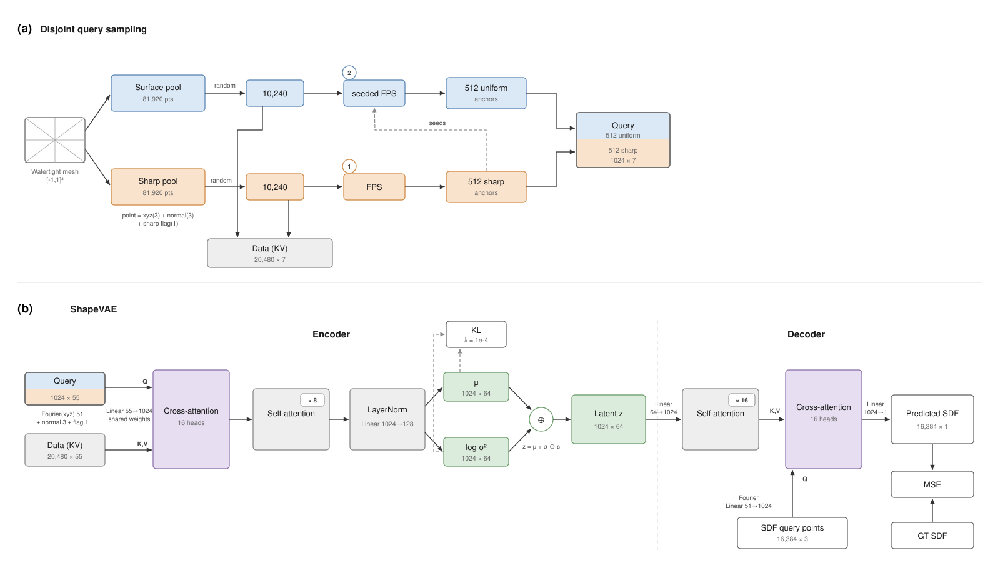
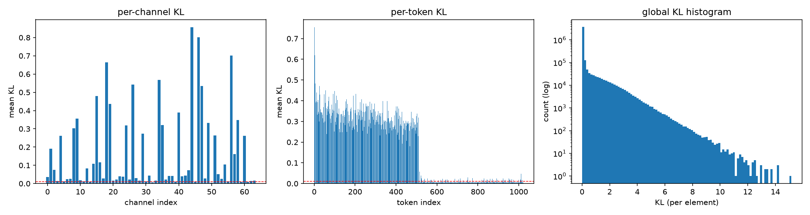
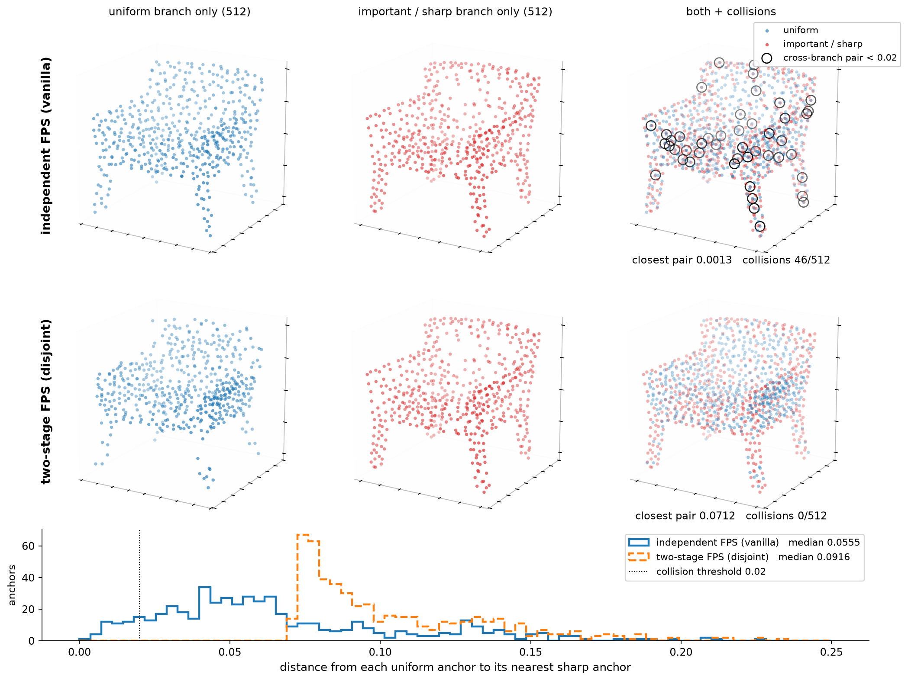
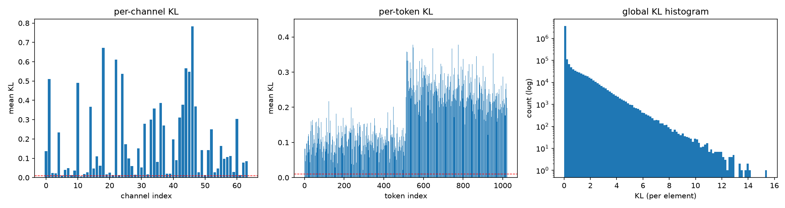
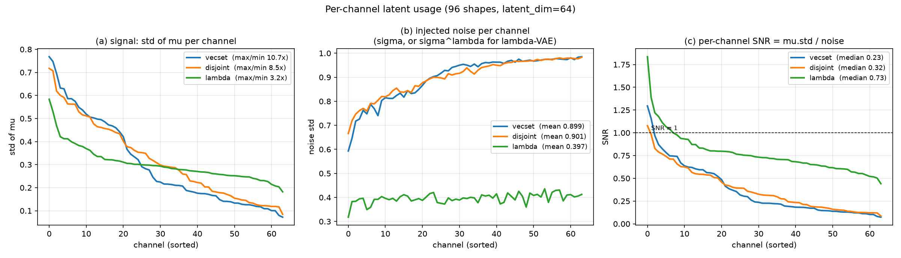

# HunYen3D

A from-scratch shape autoencoder for 3D generation, written by hand in the style of
Hunyuan3D-2 — together with a diagnosis of two ways its latent representation quietly fails,
and a fix for each.

*[繁體中文版本](README.zh.md)*

---

## At a glance

- **The problem found.** In a faithful re-implementation of the Hunyuan3D-2 shape autoencoder,
  **half of the latent tokens carry no information at all**. The dead half is precisely the half
  assigned to creases and sharp edges — the geometry people look at first when judging quality.
- **The cause.** The two groups of anchor points that define the latent tokens are selected
  independently, so they land on top of each other. The redundant group gets pruned away during
  training.
- **Fix 1 — two-stage sampling.** Choose the sharp-edge anchors first, then choose the uniform
  anchors with the sharp ones already in play so the two groups repel. Token usage goes from 54%
  to 100%, and all four reconstruction metrics improve. **No new parameters, no extra training time.**
- **Fix 2 — λ-VAE.** Tokens were only half the story; the 64 channels within each token were also
  unevenly used. Applying λ-VAE closes that second gap and improves every metric again.
- **Scale.** 328 million parameters, trained on ShapeNet-v2 on a single RTX 5080, evaluated on all
  2,592 shapes of the official test split.

| Metric | Original sampling | Two-stage sampling | Two-stage + λ-VAE |
|---|---|---|---|
| Volume IoU ↑ | 0.8980 | 0.9039 | **0.9171** |
| Chamfer Distance ↓ | 0.0142 | 0.0136 | **0.0127** |
| F-Score @ 0.02 ↑ | 0.9712 | 0.9749 | **0.9834** |
| Normal Consistency ↑ | 0.9477 | 0.9495 | **0.9547** |

*All three models are identical in architecture and parameter count. They differ only in how the
anchor points are chosen, and — in the third column — in how noise is injected during training.
See [Evaluation protocol](#evaluation-protocol) for exactly what these numbers measure.*

---

## Background: why the latent space of a 3D generator is worth studying

Generating 3D objects used to mean generating 2D images first and lifting them into three
dimensions. As large 3D datasets became available, the field moved to training directly on 3D data.
The dominant recipe today has two stages: an autoencoder compresses a 3D shape into a compact
**latent representation** (a small set of numbers standing in for the whole object), and a
diffusion model then learns to generate new points in that compressed space.

Two families of latent representation are in use, and they trade off differently.

**Sparse voxel methods** (XCube, TRELLIS) keep an explicit grid in space. Each latent value is tied
to a known location, so the generator only has to decide what the surface looks like near that
location — where the surface is, is already given by the grid.

**VecSet methods** (3DShape2VecSet, Dora, Hunyuan3D) throw the grid away. The shape becomes an
unordered set of latent vectors with no fixed spatial meaning. This compresses much harder, but it
also means the generator has to produce the surface's *position* and its *fine detail* at the same
time, from the same set of numbers. That is a harder job, and it is the usual explanation for why
VecSet methods struggle with fine geometric detail.

The Hunyuan3D team's own response to this was LATTICE: take the VecSet output, convert it into a
voxel-like representation, then run a second full generation pass on that. It works, but it walks
back the premise — VecSet existed precisely to avoid depending on an explicit spatial grid.

That suggested a different question, and it is the one this project asks:

> **Without reintroducing an explicit spatial grid, can the latent representation itself be made
> better structured, so the generator has less to carry?**

Before you can improve a representation, you have to know whether the one you have is healthy.
Checking that turned out to be the interesting part.

---

## How the latent is laid out

This matters for everything below, so it is worth two minutes.

The encoder does not compress the mesh into one big vector. It produces **1,024 latent tokens**,
each of which is 64 numbers wide. Each token is *anchored* at one point sampled from the object's
surface, and it ends up describing the geometry near that point.

The anchor points come from two separate pools, built for two different purposes:

- **Uniform pool** — points scattered evenly over the whole surface, weighted by triangle area so
  that finely-subdivided regions do not get over-represented. This gives overall coverage.
- **Sharp pool** — points sampled along creases. A vertex counts as a crease vertex when its normal
  direction differs from the surrounding faces by more than about 10 degrees; an edge counts as a
  crease when *both* of its endpoints qualify. Points are then scattered along those edges. This
  exists because creases occupy almost no surface area, so uniform sampling essentially never hits
  them — yet they are exactly what makes a chair look like a chair.

Each pool holds 81,920 points. Every training step draws a fresh subset, and **farthest point
sampling** (a greedy procedure that repeatedly picks the candidate furthest from everything already
chosen, giving well-spread coverage) reduces each subset to 512 anchors. The two halves are
concatenated into the final 1,024 tokens: **tokens 0–511 are the uniform anchors and tokens
512–1023 are the sharp anchors.**



*Panel (a) is the sampling pipeline described above; panel (b) is the full autoencoder. The small
inset in (a) reports an early small-sample measurement of the anchor spacing; the full test-set
numbers are in the table further down and should be preferred.*

---

## The finding: half the latent tokens are empty

A variational autoencoder trains against two pressures. One rewards reconstructing the input; the
other, the **KL divergence** term, pushes every latent number toward a fixed default distribution.
A token that stops being useful for reconstruction has nothing resisting the second pressure, so it
gets flattened into pure noise. This is called **posterior collapse**, and it is easy to miss,
because the usual reported KL value is a single average over the entire latent — collapse in one
half is hidden by activity in the other.

Splitting that average apart per token tells a very different story.



*Original sampling. The middle panel is one bar per latent token. The uniform-anchored half is
active; the sharp-anchored half sits flat on the floor.*

The sharp half is dead. By the standard **Active Units** criterion of Burda et al. — a dimension
counts as used if its encoded value actually varies from shape to shape, above a threshold of 0.01 —
the tokens anchored on sharp edges fail almost entirely, while the uniform-anchored ones all pass.

Counting across all three levels of granularity — every individual number, every channel, every
token — gives:

| Active Units | All 65,536 dimensions | Per-channel (64) | Per-token (1,024) |
|---|---|---|---|
| Original sampling | 34,911 (53.3%) | 61 / 64 | 525 / 1024 |
| Two-stage sampling | 60,617 (92.5%) | 63 / 64 | **1024 / 1024** |

Measured on all 2,592 shapes of the test split.

So the model is paying for 1,024 tokens and using roughly half of them, and the unused half is the
one meant to carry sharp detail.

---

## Two explanations that turned out to be wrong

Before the actual cause became clear, two reasonable hypotheses were tested and rejected. 

**Maybe the tokens cannot tell each other apart.** The encoder's attention has insufficient inherent notion of
where each anchor sits relative to the others, so perhaps the sharp tokens collapse simply because
the model cannot distinguish them. Adding **rotary position embedding** should then fix it. But the collapse still happened anyway, and reconstruction quality did
not improve. Insufficient position information was not the cause.
*Implementation:* `RoPEVAE` in `src/model/shape/VAE/vae.py`.

**Maybe the uniform anchors are simply unnecessary.** A person shown only an object's edges can
usually infer its whole shape. If the same holds for the model, the sharp anchors alone should
suffice, and the collapse of a redundant uniform branch would not matter. Replacing the uniform
queries entirely with sharp ones tested this directly. Reconstruction got *worse*, so the uniform
anchors are carrying real supervisory signal and cannot be dropped.
*Implementation:* `FrameVAE` in `src/model/shape/VAE/vae.py`.

---

## The cause: the two anchor groups land on top of each other

Plotting the anchors in 3D made it obvious. The two pools are sampled independently, and farthest
point sampling only spreads points out *within* its own pool. Nothing stops a uniform anchor from
being placed almost exactly where a sharp anchor already is.



*Top row: original sampling. Bottom row: two-stage sampling. Left and middle columns show each
branch alone; the right column overlays them, with black rings marking pairs closer than 0.02. On
this chair the original method produces 46 colliding pairs out of 512 and a closest pair of 0.0013;
the two-stage method produces none, with a closest pair of 0.0712. The histogram shows the same
thing for every anchor: the two distributions barely overlap.*

Across the full test set the effect is systematic. The closest pair of anchors in a shape averages
**0.0022** — in a coordinate system where the whole object spans 2.0 units, that is two tokens
describing the same spot.

This explains the collapse. When two tokens see nearly the same neighbourhood, one of them is
redundant, and the KL term is precisely a pressure to discard redundancy. The sharp anchors lose
that contest for two reasons: the uniform branch covers more of the surface and so is more broadly
useful under a reconstruction loss defined over all of space, and every sharp point carries an
explicit flag marking it as sharp, which makes the duplicated group easy for the model to identify
and drop.

---

## Fix 1 — two-stage (seeded) farthest point sampling

The fix follows directly from the cause, and it is small.

Instead of running the two selections independently, run them **in order**:

1. Select the sharp anchors first, by farthest point sampling on the sharp pool.
2. Select the uniform anchors second — but start the procedure with the sharp anchors already
   counted as chosen.

Because farthest point sampling always picks the candidate furthest from everything already
selected, step 2 automatically avoids regions the sharp anchors already occupy. The two groups end
up complementary instead of overlapping. Nothing else changes: same architecture, same parameter
count, same number of tokens, same training cost.

| Anchor spacing (mean over all 2,592 test shapes) | Original | Two-stage | Ratio |
|---|---|---|---|
| Closest pair of anchors, any branch | 0.0022 | **0.0517** | 23× |
| From each uniform anchor to its nearest sharp anchor | 0.0022 | **0.0553** | 25× |
| Mean spacing, all anchors | 0.0448 | 0.0621 | 1.4× |
| Mean spacing among sharp anchors only | 0.0696 | 0.0696 | unchanged |
| Mean spacing among uniform anchors only | 0.0867 | 0.0681 | 0.8× |

That fifth row is the important control: the sharp anchors' own spacing is **identical** under both
methods. The change acts only on the relationship *between* the two groups, which is exactly what it
was designed to do.

The collapse disappears:



*Two-stage sampling, same layout and same token ordering as before. Every one of the 1,024 tokens is
now above the threshold, and the sharp half (512–1023) has become the more active of the two.*

Across the full test set, **every one of the 1,024 tokens is now in use**, and the sharp-anchored
half has gone from the ignored one to the more active of the two.

---

## Fix 2 — λ-VAE for the channel axis

Fixing the tokens exposed the next problem. Every token was now in use, but the **64 channels**
inside each token still were not sharing the work evenly. Even after the sampling fix, the busiest
channel varied across shapes 8.5 times more than the quietest one — down from 10.7 times before it,
so two-stage sampling barely touches this axis.

To see why that is a problem, recall what the encoder actually produces. For each latent number it
outputs two things: a value, and an uncertainty. During training the model adds random noise scaled
by that uncertainty before handing the latent to the decoder. But when a channel's signal is small and its noise is not, the decoder simply cannot hear it, and it never learns to use that channel.

**λ-VAE** addresses this with one change, plus one deliberate non-change:

- **Shrink the noise the decoder actually receives.** Raise each channel's uncertainty to a power
  greater than one before using it to scale the noise. Since these uncertainties are below one,
  raising them to a power makes them smaller — and the smaller they are, the more they shrink. Weak
  channels therefore get the largest relief, and the signal-to-noise ratio evens out across all 64.
- **Leave the KL penalty exactly as it was.** The penalty is still computed from the encoder's
  *original* uncertainty, not the reduced one. This is the part that makes the method honest: the
  decoder gets a cleaner signal, but the model is still charged the full regularisation price, so
  the latent space is not quietly allowed to become less well-behaved.



*Left: how much each channel's value varies across shapes, sorted. Middle: how much noise each
channel receives. Right: the ratio of the two. λ-VAE flattens the noise across channels (middle,
green) and roughly doubles the median signal-to-noise ratio against two-stage sampling, 0.32 to
0.73 (0.23 for the original sampler).*

The channel imbalance drops from 8.5× to 3.2×, and every reconstruction metric improves again:

| Metric | Original sampling | Two-stage sampling | Two-stage + λ-VAE |
|---|---|---|---|
| Volume IoU ↑ | 0.8980 | 0.9039 | **0.9171** |
| Chamfer Distance ↓ | 0.0142 | 0.0136 | **0.0127** |
| F-Score @ 0.02 ↑ | 0.9712 | 0.9749 | **0.9834** |
| Normal Consistency ↑ | 0.9477 | 0.9495 | **0.9547** |

| Active Units | All 65,536 dimensions | Per-channel (64) | Per-token (1,024) |
|---|---|---|---|
| Original sampling | 34,911 (53.3%) | 61 / 64 | 525 / 1024 |
| Two-stage sampling | 60,617 (92.5%) | 63 / 64 | 1024 / 1024 |
| Two-stage + λ-VAE | **65,536 (100%)** | **64 / 64** | **1024 / 1024** |

Active Units saturates at 100% here, so it cannot show how much further λ-VAE goes. The channel
figures above are what carry that: the imbalance between channels falls from 8.5x to 3.2x and the
median signal-to-noise ratio rises from 0.32 to 0.73, neither of which the token-level count can
express.

The two fixes act on different axes — one on tokens, one on channels — so they stack, and neither
adds a single parameter.

---

## Evaluation protocol

Reconstruction numbers in this literature are easy to inflate by accident, so it is worth being
explicit about what was measured.

**Data.** ShapeNet-v2, using the watertight meshes and the train/validation/test split published by
the 3DILG authors. All numbers above are the full test split: **2,592 shapes**, every model
evaluated on the same shapes with the same query points.

**The four metrics, in plain terms.**

- **Volume IoU** — for a set of probe points, does the model agree with the ground truth about which
  ones are inside the object? Reported as the overlap between the two "inside" sets. This is overall
  volumetric correctness.
- **Chamfer Distance** — take points on the reconstructed surface and points on the true surface;
  average how far each point is from the nearest point of the other set, in both directions. This is
  the absolute size of the geometric error, so lower is better.
- **F-Score** — of the reconstructed surface points, what fraction lie within a tolerance of the
  true surface, and vice versa, combined into a single score. Unlike Chamfer it is insensitive to a
  few large outliers.
- **Normal Consistency** — do corresponding points on the two surfaces *face* the same direction?
  This catches orientation errors that position-based metrics miss.

Volume IoU is computed on 50,000 points sampled uniformly in the unit cube. Chamfer Distance and
F-Score sample 100,000 surface points from the reconstructed and the true mesh, the reconstruction
being extracted by marching cubes on a 128×128×128 grid. The F-Score tolerance is set to 0.02 to
match the spacing marching cubes can resolve at that resolution.

Full result tables: [`docs/writeup/eval_result_lambda.md`](docs/writeup/eval_result_lambda.md).

---

## Is the improvement real?

The absolute gaps are small — Chamfer improves by 4.5%, Volume IoU by about half a point. Small
average differences deserve suspicion, so the comparison was also done **shape by shape**. Because
every model saw exactly the same 2,592 shapes, each one can be scored as a win or a loss.

| Metric | Shapes where two-stage wins | Wilcoxon signed-rank test |
|---|---|---|
| Volume IoU | 70.4% | p < 1e-100 |
| Surface IoU | 70.7% | p < 1e-130 |
| Chamfer Distance | 76.1% | p < 1e-170 |
| F-Score | 66.0% | p < 1e-95 |
| Normal Consistency | 71.3% | p < 1e-115 |

The improvement is small but highly consistent, which is the more useful property. For F-Score, the
shapes where two-stage wins by a clear margin outnumber those where it loses by a clear margin
roughly five to one — the gain is spread across the dataset rather than driven by a few outliers.

It also lands where the method predicts. Surface IoU, which only counts points in a thin shell
around the surface, improves by 1.21% against Volume IoU's 0.66%, and Chamfer — the most directly
geometric of the four — improves most of all. The effect is on **surface precision**, which is what
you would expect from spreading the same number of anchors over more of the surface.

---

## Model and training setup

The architecture follows Hunyuan3D-2's shape autoencoder. The encoder cross-attends from the 1,024
anchor queries into a larger set of surface points, runs 8 self-attention layers, and emits a value
and an uncertainty for each of 64 channels per token. The decoder takes the sampled latent through
16 self-attention layers, then cross-attends from arbitrary query positions in space to predict the
**signed distance function** — for any point, how far it is from the surface, negative inside and
positive outside. Reconstruction loss is mean squared error against ground-truth distances.

See panel (b) of the architecture figure above.

| | |
|---|---|
| Parameters | 327,824,001 (identical across all three models) |
| Latent | 1,024 tokens × 64 channels |
| Width / heads | 1,024 / 16 |
| Layers | 8 encoder, 16 decoder |
| Encoder input | 1,024 queries, 20,480 key/value points |
| Point features | position (3) + normal (3) + sharp flag (1) |
| Supervision | 16,384 distance samples per step, from a bank of 250,000 |
| Learning rate | 3.5e-5 to convergence, then 3.5e-6 to convergence |
| KL weight | 1e-4 |
| Batch | 2, with gradient accumulation 16 |
| Precision | bfloat16 autocast |
| Hardware | one RTX 5080 (16 GB) |

---

## Other directions explored

The three models above are the ones with full test-set numbers. A number of other ideas were built
and run; they are listed here for completeness, with their actual status rather than a tidy
conclusion. Most were stopped once the evidence pointed elsewhere.

| Variant | Question it was asking | What happened |
|---|---|---|
| `RoPEVAE` | Is the collapse caused by tokens lacking relative position information? | No. Attention locality rose from 53.4% to 77.4%, but reconstruction did not improve and the collapse persisted. One of the two rejected hypotheses above. |
| `FrameVAE` | Are the uniform anchors redundant — can sharp anchors do the whole job? | No. Reconstruction got worse; the uniform branch carries necessary signal. The other rejected hypothesis. |
| `DoubleStreamVAE` | If the uniform and the sharp anchors are really two different kinds of input, does it help to treat them as two modalities — the way MM-DiT gives text and image their own stream and lets them exchange information through joint attention? | Reconstruction came out about the same, but the encoder's parameters double (113.6M to 226.8M) because each stream carries its own projection, cross-attention and MLP. Similar result at twice the cost, so it was dropped. |
| `MaskedVAE` | If uniform tokens may attend everywhere but sharp tokens only to sharp points, does the sharp branch stop being absorbed? | Built with a matched layer count so it adds no capacity. It converges noticeably faster, but at the channel level a great many channels come out dead, so λ-VAE is being stacked on top to address that. Still in progress. |
| `MRLVAE` | Can the 64 channels be ordered by importance, so any prefix of the latent is usable on its own? | Trained with per-prefix reconstruction losses and per-prefix loss exponents. Exploratory; no converged test-set numbers. |
| sqrt reconstruction loss | Does it help refine detail? Relative to mean-squared error, a square-root loss reallocates gradient away from the largest residuals and onto the smallest ones. Measured per point at eps=1e-4: 81× the MSE gradient at a residual of 1e-4, and 1/233 of it at 1e-1, with the two comparable around 4e-3 — roughly the current mean error. Fine detail is decided at the small-residual end. | Warm-starting from an MSE-pretrained model and continuing under the square-root loss does show an effect. But this is a preliminary observation on a run that has not converged. In progress. |

A generative model — a diffusion transformer trained with rectified flow — is also implemented in
this repository, but it has not been trained on the improved latents. Whether the better-structured
latent actually helps generation is therefore still an open question, not a claim made here.

---

## Repository layout

```
main.py                       Hydra entry point → src.engine.runner.run
configs/                      Hydra config groups
  config.yaml                 top-level defaults
  model/ task/ data/ loss/    architecture, objective, dataset, reconstruction loss
  capacity/                   latent count / depth presets shared by experiments
  experiment/                 one file per run, activated with +experiment=<name>
src/
  model/shape/VAE/            encoder, decoder, VAE variants
  model/shape/preprocess.py   mesh → anchors + distance supervision (both samplers live here)
  model/shape/diffusion/      MM-DiT denoiser and flow matching
  engine/                     Trainer, task definitions, data, checkpointing, logging
scripts/
  build_cache.py              offline preprocessing cache (run before training)
  paper_eval.py               side-by-side evaluation of several checkpoints
  evaluate.py                 single-run diagnostic evaluation
  kl_histogram.py             per-token / per-channel KL and Active Units
  anchor_scatter.py           the 3D anchor overlap figure
  smoke_test.py               a few real training steps, to check memory fits
docs/
  figures/                    figures used by this README
  writeup/
    eval_result_lambda.md     main result tables
    eval_result_256.md        resolution robustness check
```

---

## Getting started

Dependencies are managed with [uv](https://docs.astral.sh/uv/) (Python ≥ 3.13):

```bash
uv sync
```

Place watertight meshes under `data/train`, `data/val` and `data/test` (all gitignored).

Preprocessing is split in two. The expensive, deterministic part — converting a mesh to a distance
field and building the two point pools — is done once offline and cached. The cheap, random part —
drawing a subset, selecting anchors, computing positional features — runs every epoch so each epoch
sees fresh sampling.

```bash
# 1. build the cache (once)
uv run python scripts/build_cache.py +experiment=vae_disjoint_converge_kl1e-4_lr3.5e-6_1024_l8_16

# 2. check that a few real training steps fit in memory
uv run python scripts/smoke_test.py +experiment=vae_disjoint_converge_kl1e-4_lr3.5e-6_1024_l8_16

# 3. train
uv run python main.py +experiment=vae_disjoint_converge_kl1e-4_lr3.5e-6_1024_l8_16
```

The three models in the results table correspond to these experiment configs:

| Table column | Experiment config |
|---|---|
| Original sampling | `vae_converge_kl1e-4_lr3.5e-6_1024_l8_16` |
| Two-stage sampling | `vae_disjoint_converge_kl1e-4_lr3.5e-6_1024_l8_16` |
| Two-stage + λ-VAE | `vae_lambda_disjoint_converge_kl1e-4_lr3.5e-6_1024_l8_16` |

Any field can be overridden from the command line, and long runs are resumable:

```bash
uv run python main.py +experiment=<name> optimizer.lr=1e-5 trainer.max_epochs=40
uv run python main.py +experiment=<name> trainer.resume=/abs/path/to/last.pt
```

To reproduce the comparison table across checkpoints:

```bash
uv run python -m scripts.paper_eval \
    --ckpt vanilla=/abs/path/best.pt \
    --ckpt disjoint=/abs/path/best.pt \
    --ckpt lambda=/abs/path/best.pt \
    --shapes 0 --device cuda --md-out docs/writeup/eval_result.md
```

---

## Limitations and next steps

**Two-stage sampling trades away some randomness.** Under the original method the two groups of
anchors are drawn independently. Under the two-stage method the second draw is constrained by the
first, so they are no longer independent. With few training epochs this costs nothing measurable,
but over a long run with an undersized candidate pool the model could start seeing the same
pairings repeatedly, reducing effective data variety. Enlarging the pools, or designing a coupled
sampler that preserves more randomness, is the obvious next step.

**The method targets one specific kind of waste.** It recovers capacity lost to overlap between
crease anchors and uniform anchors. On data with few sharp features — organic shapes, scanned
objects — the two groups would rarely overlap in the first place, and the benefit should shrink
accordingly.

**Generation is unverified.** Everything measured here is reconstruction quality and latent
structure. The premise — that a better-structured latent makes the downstream generator's job easier
— remains untested in this repository.

---

## References

**The architecture reproduced here**

- Tencent Hunyuan3D Team. *Hunyuan3D 2.0: Scaling Diffusion Models for High Resolution Textured 3D
  Assets Generation.* arXiv:2501.12202. — The shape autoencoder and sampling procedure this project
  re-implements.
- Tencent Hunyuan3D Team. *Hunyuan3D 2.1: From Images to High-Fidelity 3D Assets with
  Production-Ready PBR Material.* arXiv:2506.15442. — The open-source release used as the
  implementation reference, and the source of the released checkpoint the cross-checks are run
  against.
- Tencent Hunyuan3D Team. *Hunyuan3D 2.5: Towards High-Fidelity 3D Assets Generation with Ultimate
  Details.* arXiv:2506.16504. — Introduces LATTICE, the shape foundation model that converts the
  VecSet output into a voxel-like representation and runs a second generation pass. Cited in the
  background as the alternative this project deliberately does not take.

**Latent representations for 3D generation**

- Biao Zhang, Jiapeng Tang, Matthias Nießner, Peter Wonka. *3DShape2VecSet: A 3D Shape
  Representation for Neural Fields and Generative Diffusion Models.* SIGGRAPH 2023.
  arXiv:2301.11445. — The VecSet representation, and the evaluation conventions (uniform query
  points, per-shape averaging) followed here.
- Rui Chen et al. *Dora: Sampling and Benchmarking for 3D Shape Variational Auto-Encoders.*
  CVPR 2025. arXiv:2412.17808. — Sharp-edge sampling for shape autoencoders, and a dual
  cross-attention encoder for detail-rich point clouds.
- Xuanchi Ren, Jiahui Huang, Xiaohui Zeng, Ken Museth, Sanja Fidler, Francis Williams. *XCube:
  Large-Scale 3D Generative Modeling using Sparse Voxel Hierarchies.* CVPR 2024 (Highlight).
  arXiv:2312.03806. — Sparse-voxel latent, cited in the background as the other family.
- *Structured 3D Latents for Scalable and Versatile 3D Generation (TRELLIS).* CVPR 2025 (Spotlight).
  arXiv:2412.01506. — The other sparse-voxel reference in the background.

**Data**

- Biao Zhang, Matthias Nießner, Peter Wonka. *3DILG: Irregular Latent Grids for 3D Generative
  Modeling.* NeurIPS 2022. arXiv:2205.13914. — Source of the watertight ShapeNet-v2 meshes and the
  train/validation/test split used for every number reported here.

**Methods and criteria used**

- Girum Demisse. *λ-VAE: Variance Equalization for Posterior Collapse.* arXiv:2607.05531. — The
  basis of Fix 2: scale the sampling noise by a per-dimension exponent while the KL penalty keeps
  the original posterior variance.
- Yuri Burda, Roger Grosse, Ruslan Salakhutdinov. *Importance Weighted Autoencoders.* ICLR 2016.
  arXiv:1509.00519. — The Active Units criterion used throughout.
- Patrick Esser, Sumith Kulal, Andreas Blattmann et al. *Scaling Rectified Flow Transformers for
  High-Resolution Image Synthesis.* arXiv:2403.03206. — The MM-DiT double-stream block that
  inspired `DoubleStreamVAE`, and the rectified-flow objective the diffusion transformer in this
  repository is trained with.
- Aditya Kusupati, Gantavya Bhatt, Aniket Rege et al. *Matryoshka Representation Learning.*
  arXiv:2205.13147. — The prefix-ordering idea behind `MRLVAE`.
- Jianlin Su et al. *RoFormer: Enhanced Transformer with Rotary Position Embedding.*
  arXiv:2104.09864. — The rotary position embedding tested in `RoPEVAE`.
- William E. Lorensen, Harvey E. Cline. *Marching Cubes: A High Resolution 3D Surface Construction
  Algorithm.* SIGGRAPH 1987. — Surface extraction used for the Chamfer, F-Score and Normal
  Consistency metrics.


The running lab notebook — papers read, hypotheses, measurements and dead ends — is kept locally
rather than published, so the reasoning behind each decision is summarised in the sections above.
